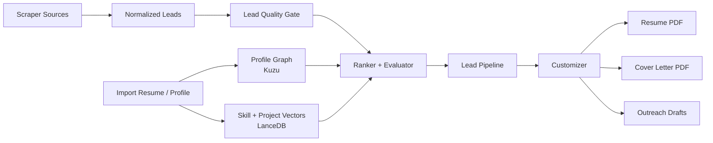
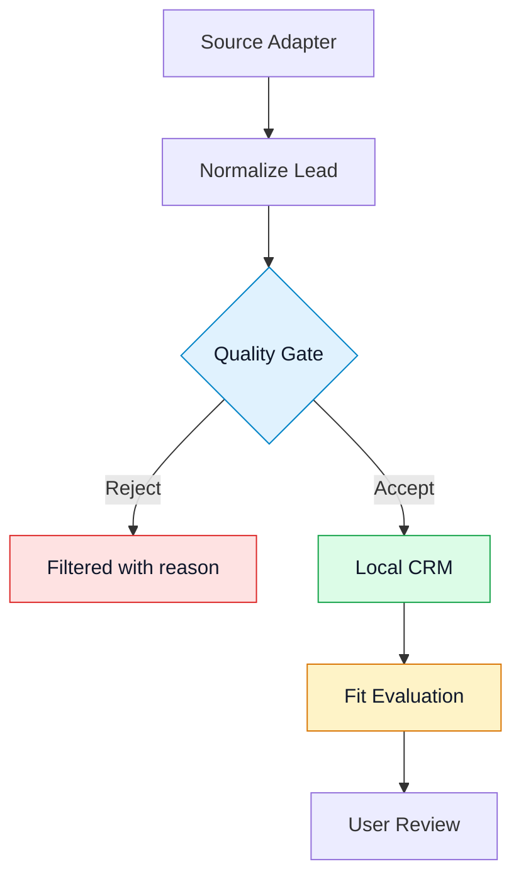
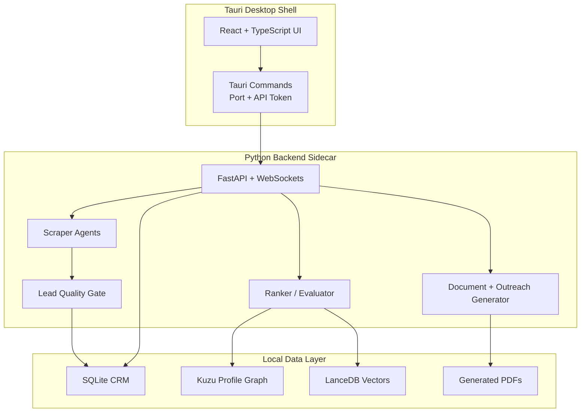
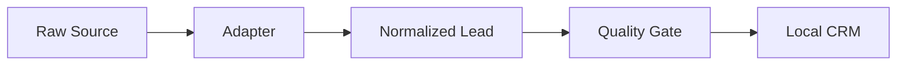
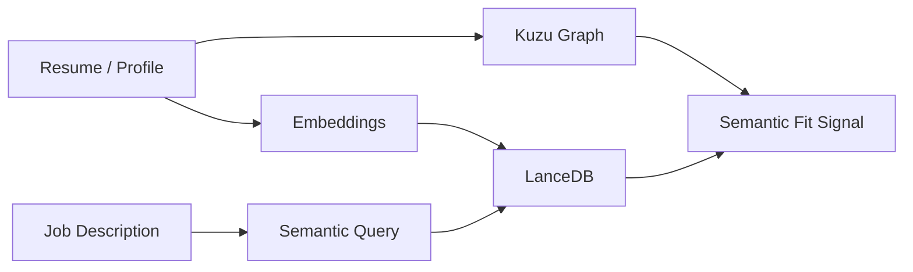
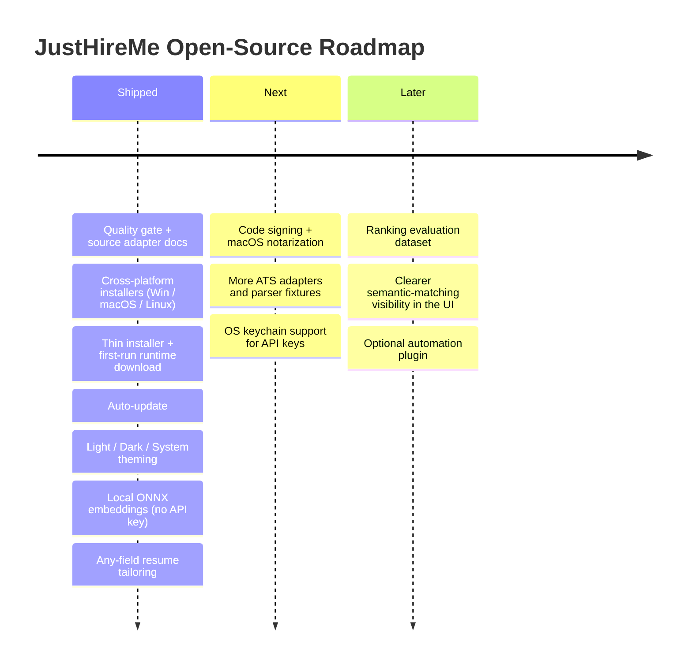

<h1 align="center">JustHireMe</h1>

<p align="center">
  <strong>Local-first AI job intelligence for scraping better roles, ranking fit, and generating tailored application materials.</strong>
</p>

<p align="center">
  <a href="LICENSE"></a>
  
  
  
  
  <a href="https://github.com/sponsors/vasu-devs"></a>
</p>

<p align="center">
  <a href="https://trendshift.io/repositories/30452?utm_source=trendshift-badge&utm_medium=badge&utm_campaign=badge-trendshift-30452" target="_blank" rel="noopener noreferrer"></a>
  <a href="https://trendshift.io/repositories/30452?utm_source=trendshift-badge&utm_medium=badge&utm_campaign=badge-trendshift-30452" target="_blank" rel="noopener noreferrer"></a>
</p>

<p align="center">
  <a href="#what-it-does">What It Does</a>
  &middot;
  <a href="#visual-workflow">Workflow</a>
  &middot;
  <a href="#architecture">Architecture</a>
  &middot;
  <a href="#quick-start">Quick Start</a>
  &middot;
  <a href="#standard-procedure">Standard Procedure</a>
  &middot;
  <a href="#agent-skill-and-mcp">Agent Skill + MCP</a>
  &middot;
  <a href="#contributing">Contributing</a>
  &middot;
  <a href="#roadmap">Roadmap</a>
</p>

---

## Star History

<a href="https://www.star-history.com/?repos=vasu-devs%2FJustHireMe&type=timeline&legend=top-left">
 <picture>
   <source media="(prefers-color-scheme: dark)" srcset="https://api.star-history.com/chart?repos=vasu-devs/JustHireMe&type=timeline&theme=dark&legend=top-left" />
   <source media="(prefers-color-scheme: light)" srcset="https://api.star-history.com/chart?repos=vasu-devs/JustHireMe&type=timeline&legend=top-left" />
   
 </picture>
</a>

---

## The Short Version

JustHireMe is an AGPL-licensed, local-first desktop workbench for people who are tired of noisy job boards and black-box AI apply tools.

## Maintainer

JustHireMe is built and maintained by Vasudev Siddh - full-stack AI engineer, open-source builder, and the person who got tired of bad job boards and built something better.

**Sponsor the project** - Sponsorship keeps JustHireMe actively maintained, funds source adapter coverage, and supports the local-first architecture that makes this different from every cloud-first alternative.

## Current Status

JustHireMe's stable core is the local-first desktop workbench, Python sidecar API, lead ingestion, deterministic ranking, profile-aware matching, local CRM workflows, and document/outreach generation. Every release is built by GitHub Actions from a `v*` tag and now ships installers for **Windows, macOS, and Linux**.

| Area | Status |
| --- | --- |
| Frontend workbench | Stable |
| Python sidecar API | Stable |
| Scraper, ranking, vector matching, and customizer core | Supported open-source scope |
| Windows installer (`.exe`) | Released every version |
| macOS installer (`.dmg` + `.app`) | Released every version (ad-hoc signed, **not yet notarized** — Gatekeeper may need "Open Anyway"; see [docs/INSTALL_MACOS.md](docs/INSTALL_MACOS.md)) |
| Linux packages (`.deb` + AppImage) | Released every version |
| Auto-update | Built in; the app updates itself from the latest GitHub release |
| Thin installer + first-run runtime | Installer is ~100 MB; the heavy runtime (browser + vector libs + embedding model) downloads once on first run, then is cached |
| Dark mode | Light / Dark / System, system-aware, shipped |
| Local embeddings | Bundled ONNX model (`all-MiniLM-L6-v2`) with a deterministic hashing fallback — semantic matching works fully offline, no API key |
| Keyless by default | Discovery, ranking, and generation all run with zero API key — local Ollama or your existing Claude Code / Codex CLI subscription can power every LLM step; keyed providers (OpenAI, Gemini, Groq, and 15+ others) are optional, not required |
| Field-agnostic | Discovery, ranking, and tailoring work for any field (healthcare, trades, finance, law, education, hospitality, creative, software, ...) — scoring is relative to the candidate's own domain, not a fixed tech vocabulary |
| Location-agnostic | Targets any city/region worldwide; location is auto-detected from your résumé (or set explicitly), with remote / hybrid / onsite preference |
| Resume tailoring | Works for any field (engineering, design, finance, healthcare, education, trades, ...) |
| Résumé/profile ingestion | Tolerates real-world profile shapes (PDF/DOCX/TXT/MD, JSON Resume exports, LinkedIn zips, GitHub, portfolio URLs) and shows a transparent import report — what was pulled in, skipped, or capped |
| Explainable matching | Fit scores are backed by GraphRAG proof from your own Kùzu skill/project graph, not just a number |
| Browser automation / auto-apply | Experimental lab, disabled by default |
| API key storage | Local app settings; `.env` is for development overrides; OS keychain planned |

If you are new here, start with the frontend preview first. If you want to contribute backend behavior, source adapters, or packaging, use the full desktop setup below.

It helps you:

| Stage | What JustHireMe Does | Why It Matters |
| --- | --- | --- |
| Scrape | Collect leads from ATS boards, feeds, communities, APIs, and configured sources | You are not locked into one job board |
| Quality Gate | Reject stale, thin, spammy, senior-only, or low-context leads before they pollute the pipeline | Better signal, less cleanup |
| Rank | Score lead quality and candidate fit with explainable deterministic rules, feedback learning, and optional LLM reasoning | You can see why a role is worth attention |
| Match | Use Kuzu graph data and LanceDB vectors to compare jobs against your profile context | Matching is profile-aware, not keyword-only |
| Customize | Generate tailored resume PDF, cover letter PDF, and outreach drafts | You get a useful package, not just a list of links |

> Browser automation and auto-apply code exists in the repository, but it is experimental, opt-in, and unsupported as part of the stable core. The supported open-source core is scraper, ranker, vector matching, and customizer.

---

## Visual Workflow





---

## What It Does

<table>
  <tr>
    <td width="50%">
      <h3>Scrape From Many Sources</h3>
      <p>Collect jobs from ATS/company boards, RSS feeds, Hacker News, GitHub-style sources, Reddit/community sources, APIs, and custom configured targets.</p>
    </td>
    <td width="50%">
      <h3>Reject Low-Quality Leads</h3>
      <p>Apply a deterministic quality gate before saving leads. Filter stale, thin, senior-only, unpaid, spammy, or missing-context postings.</p>
    </td>
  </tr>
  <tr>
    <td width="50%">
      <h3>Rank Fit Transparently</h3>
      <p>Score role alignment, stack coverage, project evidence, seniority fit, location constraints, red flags, source signal, and semantic profile similarity.</p>
    </td>
    <td width="50%">
      <h3>Generate Tailored Packages</h3>
      <p>Create a resume PDF, cover letter PDF, founder message, LinkedIn note, cold email, keyword coverage summary, and selected-project rationale - for roles in any field, not just software.</p>
    </td>
  </tr>
</table>

---

## Why This Exists

Most job search tools make one of two mistakes:

| Problem | Result |
| --- | --- |
| They scrape too broadly | Users drown in stale, irrelevant, senior-only, or spammy jobs |
| They automate too aggressively | Users lose control and trust |
| They rank opaquely | Nobody knows why a job was recommended |
| They are cloud-first | Sensitive profile/job data leaves the user's machine |
| They are hard to extend | Contributors cannot easily add new sources or improve ranking |

JustHireMe takes a different path:

```text
More signal.
More explanation.
More local control.
More contributor-friendly source adapters.
Less blind automation.
```

---

## Product Principles

| Principle | Meaning |
| --- | --- |
| Local-first | Profile data, lead history, generated docs, graph data, vectors, and settings live locally by default |
| Explainable | Every important ranking and filtering decision should have a visible reason |
| Contributor-friendly | Adding a source adapter should be approachable and testable |
| Human-controlled | Generated materials are drafts for review, not magic submissions |
| Honest fallback | If vectors, models, or source data fail, the app should say so |
| Automation is experimental | Browser automation is a lab area, not the core open-source promise |

---

## Architecture



| Area | Technology |
| --- | --- |
| Desktop shell | Tauri 2 (auto-updating, Light/Dark/System theming) |
| Frontend | React 19, TypeScript, Vite, Tailwind CSS |
| Backend API | Python 3.13, FastAPI, WebSockets |
| Local CRM | SQLite |
| Profile graph | Kuzu |
| Vector store | LanceDB |
| Embeddings | Local ONNX model (`all-MiniLM-L6-v2`) with a hashing fallback - no API key required |
| LLM providers | Keyless: Ollama, Claude Code CLI, Codex CLI. Keyed (optional): OpenAI, Anthropic, Gemini, Groq, DeepSeek, and 15+ others via a common provider abstraction |
| Matching | Deterministic scoring + GraphRAG proof from the profile graph, local semantic search, optional LLM evaluation |
| Documents | Markdown/PDF rendering |
| Experimental lab | Playwright browser automation |
| Packaging | Thin Tauri installer + first-run runtime pack (Windows / macOS / Linux) |

**First-run runtime pack.** To keep installers small (~100 MB instead of ~450-700 MB), the heavy runtime - the Playwright browser, vector libraries, and the ONNX embedding model - is not bundled into the installer. The app downloads it once on first run, verifies it, and caches it. The pack is content-versioned, so routine app updates reuse the cached pack instead of re-downloading it.

More detail: [docs/ARCHITECTURE.md](docs/ARCHITECTURE.md)

---

## Repository Map

```text
JustHireMe/
|-- src/                         React frontend workbench
|   |-- api/                     HTTP/WebSocket API clients and types
|   |-- features/                Activity, apply, dashboard, graph, inbox, pipeline, profile, settings
|   |-- shared/                  Components, hooks, context, utilities
|   `-- main.tsx                 Frontend entrypoint
|-- backend/                     Python FastAPI sidecar
|   |-- api/                     FastAPI app, routers, auth, scheduler, WebSockets
|   |-- automation/              Scout scraping orchestration + experimental apply/actuator
|   |-- core/                    Config, occupation vocab, SSRF guard, telemetry
|   |-- data/                    SQLite repos, Kùzu graph, LanceDB vectors, migrations
|   |-- discovery/               Query generation, dedup, quality gate, source adapters
|   |-- gateway/                 Async job tracking, discovery config
|   |-- generation/              Resume, cover letter, and outreach generators
|   |-- graph_service/           Query helpers behind the knowledge-graph view
|   |-- llm/                     Provider abstraction (keyed + keyless/subscription-CLI), embeddings
|   |-- profile/                 Resume/LinkedIn/GitHub/portfolio ingestion + normalization
|   |-- ranking/                 Fit scoring, criteria, semantic/evaluator logic
|   `-- tests/                   Backend unit, integration, and regression tests
|-- src-tauri/                   Tauri Rust shell
|   `-- resources/               Bundled sidecar/runtime resources generated for packages
|-- website/                     Public website
|-- docs/                        Architecture, source adapter, release docs
|-- scripts/                     Build scripts
|-- skills/                      Agent skill instructions
`-- .github/                    CI, issue templates, PR template
```

---

## Quick Start

### Install The Desktop App

Use this path if you are not a developer and just want to run JustHireMe. Open the latest [GitHub Release](https://github.com/vasu-devs/JustHireMe/releases/latest) and grab the asset for your platform.

| Platform | Download | Notes |
| --- | --- | --- |
| Windows | `JustHireMe_*_x64-setup.exe` | If SmartScreen appears, click **More info** -> **Run anyway** |
| macOS (Apple Silicon) | `JustHireMe_*_aarch64.dmg` | Not yet notarized: if macOS says the app is damaged/unverified, allow it in **System Settings -> Privacy & Security -> Open Anyway** |
| Linux (Debian/Ubuntu) | `JustHireMe_*_amd64.deb` | `sudo dpkg -i` the file |
| Linux (portable) | `JustHireMe_*_amd64.AppImage` | `chmod +x` then run it |

**First launch downloads the runtime pack.** The first time you open the app it fetches the runtime (browser + vector libraries + embedding model) over HTTPS and caches it; this is a one-time download. After that, the app starts offline-ready and routine updates do not re-download it.

The app updates itself automatically from the latest GitHub release. Release notes include SHA256 checksums, and every installer is built by GitHub Actions from the release tag so the published binary matches the repository source.

### Requirements

| Tool | Version |
| --- | --- |
| Node.js | 24 recommended; CI uses Node 24 |
| Python | 3.13+ |
| Rust | stable |
| uv | latest stable |
| Git | any modern version |

Optional:

- Ollama for local model experiments
- Playwright browser dependencies only for experimental automation work

### Fast Frontend Preview

Use this path if you just want to inspect the UI, design direction, or frontend code.

```bash
git clone https://github.com/vasu-devs/JustHireMe.git
cd JustHireMe
npm ci
npm run dev
```

This starts the Vite frontend only. Backend-backed workflows may show empty, mocked, or unavailable states depending on the screen.

### Full Desktop Setup

Use this path if you want the Tauri shell and Python backend sidecar.

```bash
git clone https://github.com/vasu-devs/JustHireMe.git
cd JustHireMe
npm ci
cd backend
uv sync --dev
cd ..
```

Then run:

```bash
npm run tauri dev
```

The Tauri shell starts the frontend and launches the Python backend sidecar/dev process.

Install website dependencies only when working on the public website or running the full local check group:

```bash
cd website
npm ci
cd ..
```

### Before Opening An Issue

- Check whether the bug is in supported core behavior or experimental automation.
- Remove API keys, cookies, resumes, local databases, and generated private documents from logs or screenshots.
- For source requests, include a public example URL and expected normalized fields.
- For ranking bugs, include the expected score behavior and sanitized job/profile snippets.

---

## Development Commands

| Task | Command |
| --- | --- |
| Install frontend dependencies | `npm ci` |
| Install backend dependencies | `cd backend && uv sync --dev` |
| Install website dependencies | `cd website && npm ci` |
| Frontend dev server | `npm run dev` |
| Website dev server | `cd website && npm run dev` |
| Desktop dev app | `npm run tauri dev` |
| Version consistency check | `npm run version:check` |
| TypeScript check | `npm run typecheck` |
| Frontend tests | `npm test` |
| Frontend build | `npm run build` |
| Backend tests | `cd backend && uv run python -m pytest tests -q` |
| Backend regression smoke | `cd backend && uv run python -m pytest tests/test_regressions.py tests/test_api.py::TestAuthGate` |
| Keyless LLM CLI smoke (Ollama/Claude Code/Codex CLI) | `npm run smoke:llm-cli` |
| Live source connectivity smoke | `npm run smoke:live-sources` |
| Rust tests | `cd src-tauri && cargo test --lib` |
| Rust check | `cd src-tauri && cargo check` |
| Website build | `cd website && npm run build` |
| All local checks | `npm run check` |
| Build sidecar | `npm run build:sidecar` |
| Build frontend, website, and Rust check | `npm run build:all` |
| Fast release smoke | `npm run release:smoke` |
| Release preflight | `npm run release:preflight` |
| Windows installer package rehearsal (requires updater signing env) | `npm run release:windows` |
| Linux packages | `npm run release:linux` |
| macOS package | `npm run release:macos` |

`npm run check` runs the version check, frontend typecheck, frontend tests, frontend build, website build, backend tests, Rust tests, and Rust check. Run `npm ci`, `cd backend && uv sync --dev`, and `cd website && npm ci` first so every lane has its dependencies.

On Windows PowerShell, use `npm.cmd` instead of `npm` if the `npm.ps1` shim is blocked by execution policy. If your shell does not support `&&`, run the `cd` command and the following command as separate lines.

---

## Standard Procedure

Use this workflow for normal development and pull requests:

1. Sync from the lockfiles: `npm ci`, `cd backend && uv sync --dev`, and `cd website && npm ci` if the website or full check suite is involved.
2. Keep changes focused. Core product work should preserve local-first storage, explainable ranking, and human-reviewed generation. Browser automation stays experimental and opt-in.
3. Run targeted checks for the area you changed, then run `npm run check` before opening a PR when practical.
4. Add or update tests for behavior changes. Use backend regression tests for ranking, source, API, storage, and generation changes.
5. Update docs whenever setup, commands, release behavior, user-facing workflows, source adapter contracts, or privacy expectations change.
6. Do not commit `.env`, API keys, cookies, bearer tokens, private resumes, local databases, graph/vector stores, generated PDFs, app data, or generated sidecar binaries.

Use this release flow for maintainer builds:

1. Bump all versioned files with `npm run version:bump -- X.Y.Z`.
2. Run local validation with `npm run check:all`, `npm run lint`, `npm run test:coverage`, `npm run release:smoke`, and `npm run smoke:windows-update`.
3. Push a `vX.Y.Z` tag and let GitHub Actions build, sign, verify updater metadata, smoke the Windows installer, generate checksums, and publish release assets from CI.
4. Verify generated updater artifacts with `npm run release:verify-updater -- release-assets vX.Y.Z` when checking a downloaded CI asset folder.

Detailed release checklists live in [docs/MAINTAINER_RELEASE_CHECKLIST.md](docs/MAINTAINER_RELEASE_CHECKLIST.md), [docs/windows-release.md](docs/windows-release.md), and [docs/PRODUCTION_RELEASE_ROADMAP.md](docs/PRODUCTION_RELEASE_ROADMAP.md).

---

## Agent Skill And MCP

JustHireMe includes two reusable agent surfaces:

- An agent-neutral skill at `skills/justhireme/SKILL.md`
- A lightweight stdio MCP server at `backend/mcp_server.py`

The skill is plain Markdown with YAML frontmatter. It is written to be useful in any AI coding assistant that can load local instructions, including Claude, Codex, IDE agents, and custom agent runners. It tells an agent how to work safely inside this repository: preserve local-first behavior, keep ranking explainable, treat browser automation as experimental, and use the existing backend/frontend patterns.

### Use The Skill

Point your agent or assistant at:

```text
skills/justhireme/SKILL.md
```

If your agent expects skills in a separate directory, copy or symlink the `skills/justhireme` folder into that tool's skill/instruction location. The skill has no runtime dependency on Codex-specific APIs.

### Use The MCP Server

Install backend dependencies first:

```bash
cd backend
uv sync --dev
cd ..
```

Start the MCP server from the repository root on Windows:

```powershell
backend\.venv\Scripts\python.exe backend\mcp_server.py
```

Start it on macOS/Linux:

```bash
backend/.venv/bin/python backend/mcp_server.py
```

The MCP server exposes:

| Tool | Purpose |
| --- | --- |
| `score_job_fit` | Score a raw job posting against a candidate JSON profile |
| `evaluate_lead_quality` | Run the deterministic quality gate for a normalized lead |
| `extract_lead_intel` | Extract company, location, budget, urgency, stack, and signal quality from lead text |

Example MCP client configuration:

```json
{
  "mcpServers": {
    "justhireme": {
      "command": "/absolute/path/to/JustHireMe/backend/.venv/bin/python",
      "args": ["/absolute/path/to/JustHireMe/backend/mcp_server.py"],
      "cwd": "/absolute/path/to/JustHireMe"
    }
  }
}
```

On Windows, use the venv interpreter at `backend\\.venv\\Scripts\\python.exe`. More detail: [docs/MCP.md](docs/MCP.md)

---

## Core Concepts

### Source Adapters

Source adapters turn external job sources into normalized lead dictionaries.
Implementations live in `backend/discovery/sources/` (ATS boards, RSS/Atom, Hacker News, GitHub, Reddit, custom JSON, and a Playwright-backed web fallback); `backend/automation/scout.py` fans out across them, dedupes, and hands results to the quality gate.



Read: [docs/source-adapters.md](docs/source-adapters.md)

### Quality Gate

The gate lives in `backend/discovery/quality_gate.py`.

It checks:

| Signal | Example |
| --- | --- |
| URL exists | Reject rows with no source/apply URL |
| Posting depth | Penalize thin scraped snippets |
| Freshness | Penalize stale jobs |
| Seniority | Reject senior-only roles in beginner-focused feeds |
| Red flags | Penalize unpaid, commission-only, no-budget, homework, or exposure posts |
| Company/context | Penalize missing company or unclear source context |

### Ranking

Ranking combines:

- source signal
- lead quality score
- deterministic fit rubric
- seniority caps
- project and stack evidence
- optional LLM-assisted evaluation
- semantic fit when vectors are available
- feedback learning

### Vector Matching



### Customizer

For a strong lead, the customizer produces:

| Output | Purpose |
| --- | --- |
| Tailored resume PDF | Role-specific resume package |
| Cover letter PDF | Focused application narrative |
| Founder message | Short direct outreach |
| LinkedIn note | Concise connection/message draft |
| Cold email | Longer outreach draft |
| Keyword coverage | Shows what the generated package covers |
| Selected projects | Explains which profile evidence was used |

---

## Configuration And Privacy

Settings are configured inside the desktop app. For v1, API keys are stored in local app settings.

Local data may include:

| Data | Stored Locally |
| --- | --- |
| Profile graph | yes |
| Vector tables | yes |
| Lead CRM | yes |
| Generated PDFs | yes |
| Settings | yes |
| Activity history | yes |

Do not share screenshots, logs, local app data, issue attachments, or database files that contain API keys, cookies, private resumes, or personal data.

Planned improvement:

- OS keychain-backed API key storage

---

## Release Builds

Every release builds and publishes installers for **Windows, macOS, and Linux** from a single `v*` tag via GitHub Actions - never uploaded from a maintainer workstation. The pipeline builds each platform's sidecar and Tauri installer, runs an auto-update smoke test, generates SHA256 checksums, and publishes the assets. Windows and macOS builds are not yet code-signed/notarized, so the OS may warn on first launch (see the install table above); code signing and macOS notarization are the next packaging milestone.

```powershell
npm run release:smoke
npm run smoke:windows-update
```

Use `npm run release:windows` only for an intentional local package rehearsal when Tauri updater signing variables are available. Use `npm run release:linux` or `npm run release:macos` for platform-specific local package builds when you are explicitly testing those paths.

Release smoke test and packaging details: [docs/windows-release.md](docs/windows-release.md), [docs/MAINTAINER_RELEASE_CHECKLIST.md](docs/MAINTAINER_RELEASE_CHECKLIST.md), and [docs/PRODUCTION_RELEASE_ROADMAP.md](docs/PRODUCTION_RELEASE_ROADMAP.md).

---

## Contributing

The best first contribution path is scraper/source quality.

<table>
  <tr>
    <td width="33%">
      <h3>Good First Issues</h3>
      <p>Add parser fixtures, improve docs, polish UI copy, or add a small source rule.</p>
    </td>
    <td width="33%">
      <h3>Source Contributors</h3>
      <p>Add ATS/company-board adapters with normalized lead fields and quality-gate tests.</p>
    </td>
    <td width="33%">
      <h3>Ranking Contributors</h3>
      <p>Improve score bands, seniority handling, semantic fallback, and feedback learning.</p>
    </td>
  </tr>
</table>

Start here:

| Document | Purpose |
| --- | --- |
| [CONTRIBUTING.md](CONTRIBUTING.md) | Contribution rules and development workflow |
| [CODE_OF_CONDUCT.md](CODE_OF_CONDUCT.md) | Community standards |
| [docs/ARCHITECTURE.md](docs/ARCHITECTURE.md) | System design |
| [docs/source-adapters.md](docs/source-adapters.md) | Scraper adapter contract |
| [docs/FEATURE_TEST_MATRIX.md](docs/FEATURE_TEST_MATRIX.md) | Which features are verified and how |
| [docs/MAINTAINER_RELEASE_CHECKLIST.md](docs/MAINTAINER_RELEASE_CHECKLIST.md) | Release and safety checklist |
| [ROADMAP.md](ROADMAP.md) | Project direction |
| [SECURITY.md](SECURITY.md) | Privacy and responsible reporting |

Please do not open public issues with API keys, resumes, cookies, bearer tokens, or database files.

---

## Experimental Automation

The repository contains browser automation and auto-apply code for experimentation and future plugin work. This is distinct from the scraping scout (`backend/automation/scout.py`), which is core, supported, and always on — "experimental" here refers specifically to the DOM-fill/vision-based apply actuator, not lead discovery.

| Status | Meaning |
| --- | --- |
| Disabled by default | Not part of the supported job workflow |
| Unsupported lab | Useful for contributors, not normal users |
| Not marketed as core | The product works without it |
| Potential future plugin | May be separated later |

---

## Roadmap



Near-term priorities:

- code signing for Windows and notarization for macOS (remove first-launch security warnings)
- more high-quality ATS/company source adapters
- stronger quality gate tests
- clearer vector matching state in the UI
- contributor-friendly source plugin boundaries
- OS keychain support for API keys

---

## Legal & Privacy

JustHireMe is local-first: your profile, leads, and generated documents stay on your device. The full policies live in [docs/legal/](docs/legal/):

| Document | Purpose |
| --- | --- |
| [Terms of Use](docs/legal/terms-of-use.md) | Rules for using the app and site, your responsibilities, warranty/liability |
| [Privacy Policy](docs/legal/privacy-policy.md) | What is and isn't collected (almost nothing leaves your machine) |

These policies govern use of the app and site; the source code is licensed separately under AGPL-3.0 (below). Governed by the laws of India; contact pls@justhireme.ai. See the [legal index](docs/legal/README.md).

---

## License

JustHireMe is open source under the [GNU Affero General Public License v3.0 only](LICENSE).

You may self-host, modify, and use JustHireMe, including with your own API
keys, under the terms of the AGPL-3.0 license. If you modify JustHireMe and
make it available over a network, the AGPL requires you to provide the
corresponding source code for that modified version to users of the network
service.

Commercial licenses are available for organizations that want to use
JustHireMe outside the AGPL terms, including private forks, proprietary
modifications, embedding, white-labeling, or managed deployments. See
[COMMERCIAL_LICENSE.md](COMMERCIAL_LICENSE.md) for the commercial path.

---

## Maintainer Note

This project is being built in the open because one person cannot cover every job source, every market, every ranking edge case, and every packaging path alone.

The goal is a useful local tool and a welcoming codebase where contributors can add sources, improve ranking, and help job seekers get better signal with less noise.
