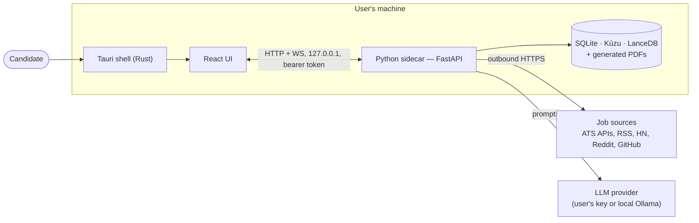
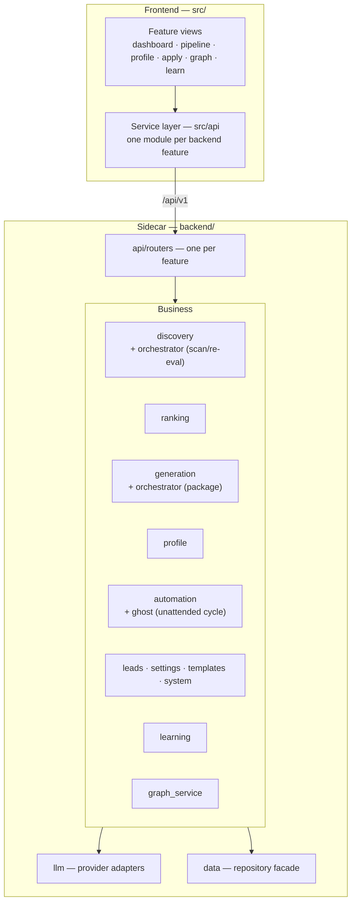
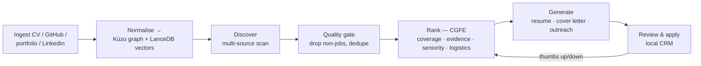

# High-Level Design — JustHireMe

**Version:** 1.4.0 · **Status:** shipping · **Scope:** the installed desktop application.

## 1. Purpose

JustHireMe finds jobs a candidate is actually a fit for, scores that fit with
evidence, and generates a tailored resume, cover letter and outreach package per
role. It runs **entirely on the user's machine**: their CV, their job pipeline and
their generated documents never leave the device except as prompts to whichever
LLM provider the user configured.

## 2. Quality attributes that shaped the design

| Attribute | Decision it forced |
|---|---|
| **Privacy** | Local-first. SQLite/Kùzu/LanceDB on disk; no JustHireMe server; sidecar binds loopback only. |
| **Works without paid keys** | Keyless discovery sources are on by default; deterministic scoring runs with no LLM; embeddings degrade to hashing. |
| **Field-agnostic** | No hard-coded tech taxonomy in scoring. A nurse and a Kubernetes engineer are scored by the same candidate-relative engine. |
| **Honest degradation** | Every subsystem reports its real state (`/health/subsystems`); a hashing fallback is surfaced, never silently pretended to be semantic. |
| **Discoverable configuration** | Every environment variable is declared in one registry (`core/env.py`) and documented in `.env.example`; both are test-enforced. |
| **Survivable UI** | Long operations are background jobs pushed over WebSocket, so a 3-minute generation never blocks the window. |

## 3. Context

The Tauri shell owns process lifecycle: it starts the sidecar on a reserved
loopback port, mints and holds the API token, hands both to the webview, and
handles OS integration (notifications, updater, external links).

## 4. Component view

## 5. The core pipeline

Each stage is independently useful and independently degradable: discovery works
with no keys, ranking works with no LLM, generation is the only stage that
strictly requires a model.

## 6. Storage

Three stores, each chosen for one job:

| Store | Holds | Why not the others |
|---|---|---|
| **SQLite** | leads, settings, events, metrics, error log, templates | Transactional, queryable, single-file, zero-config. |
| **Kùzu** (graph) | candidate profile: skills, projects, experience, credentials and the edges between them | Relationship queries ("which projects evidence this skill") are the point; they are painful in SQL and meaningless in a vector store. |
| **LanceDB** (vectors) | embeddings of profile entities and job text | Semantic similarity for field-agnostic matching. |

Durability note: the profile is additionally persisted as a **snapshot** in
SQLite. If the native graph store is unavailable or empty, the Knowledge view is
rebuilt from that snapshot instead of showing an empty canvas.

## 7. Security model

- **Loopback only.** The sidecar binds 127.0.0.1; `TrustedHostMiddleware`
  rejects any non-loopback `Host` header (defence against DNS rebinding).
- **Bearer token** minted per process by the shell; every route except `/health`
  requires it. WebSocket upgrades are token-guarded too.
- **CORS** is closed except for the local webview origin pattern.
- **SSRF guard** (`core/url_guard.py`) on every user-supplied URL — portfolio
  crawling and job fetching cannot be pointed at internal addresses.
- **Rate limits** on the expensive and abusable routes (generation, manual leads,
  help chat, error reporting).
- **Error responses carry no internals.** Unhandled exceptions return a generic
  500 plus a request id; the detail is recorded server-side. Logs are redacted
  and length-bounded.

## 8. Failure and degradation

| Failure | Behaviour |
|---|---|
| No LLM key | Discovery and deterministic scoring still run. Generation is blocked with a clear reason. |
| LanceDB missing | Semantic matching falls back to hashing; `/health/subsystems` reports `hashing`, and the UI surfaces it. |
| Kùzu locked/empty | Profile served from the SQLite snapshot; graph reports `degraded` rather than empty. |
| Generation fails transiently | Lead stays in `tailoring` with a `Retry-After` hint instead of being reverted. |
| Source unreachable | That source is skipped and counted; the scan continues. |

## 9. Deferred / known limits

- Single-tenant by construction. Multi-user requires a hosted rewrite (see `PIVOT_ARCHITECTURE.md`).
- `_domain_from_url` uses a two-label heuristic, not the Public Suffix List, so
  `acme.co.uk` resolves to `co.uk`.
- Newer ATS hostnames (e.g. `job-boards.greenhouse.io`) are not in `ATS_HOSTS`,
  so contact lookup can infer the ATS vendor's domain instead of the employer's.

See [LLD.md](LLD.md) for module-level design, [SRS.md](SRS.md) for requirements,
[UML.md](UML.md) for the structural and behavioural diagrams, and
[LAYERS.md](LAYERS.md) for the enforced dependency rules.
