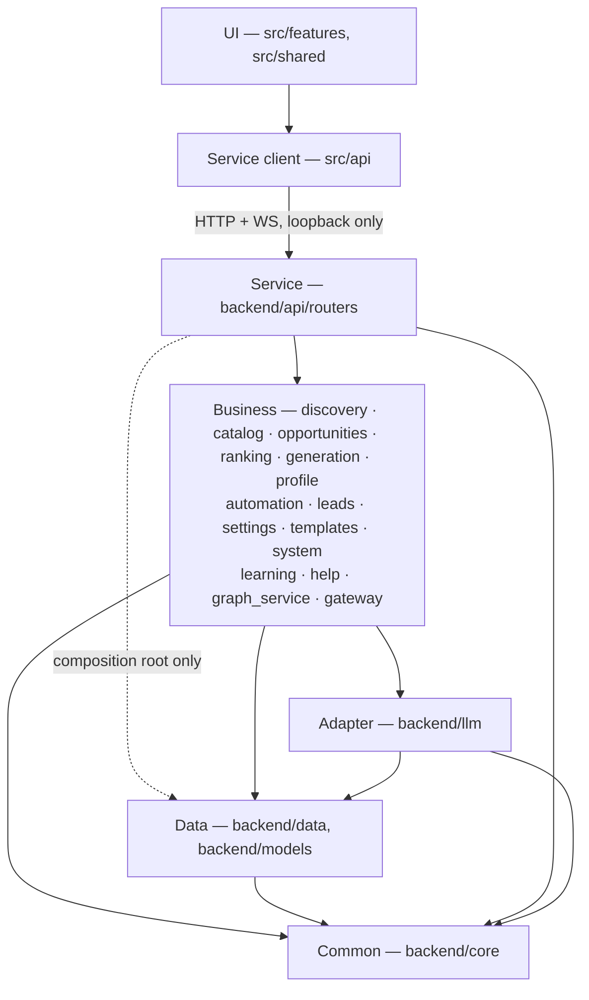
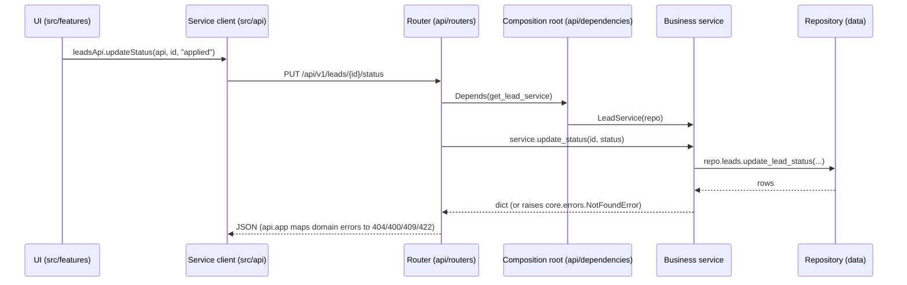

# Layered architecture

JustHireMe is organised in five layers. Packages are **feature-first** (all of
discovery lives in `discovery/`), and the layer is expressed by *which package
a module lives in* and *what it is allowed to import* — not by a folder called
`Business/`.

The rule is enforced, not documented-and-hoped-for:
[`backend/tests/unit/architecture/test_import_boundaries.py`](../backend/tests/unit/architecture/test_import_boundaries.py)
fails CI on any violation.

## The layers

| Layer | Where it lives | Responsibility |
|---|---|---|
| **UI** | `src/` | React views, components, hooks, styling. Renders state; owns no protocol knowledge. |
| **Service (client)** | `src/api/` | One module per backend feature. Owns every URL, verb and payload the UI sends. |
| **Service (server)** | `backend/api/` | FastAPI routers. Transport only: parse, authorise, delegate, serialise. |
| **Business** | `backend/discovery/`, `catalog/`, `opportunities/`, `ranking/`, `generation/`, `profile/`, `automation/`, `leads/`, `settings/`, `templates/`, `system/`, `learning/`, `help/`, `graph_service/`, `gateway/`, `reporting/` | Domain rules and orchestration. The part worth testing. |
| **Adapter** | `backend/llm/` | Outbound third-party calls (Anthropic, Gemini, Groq, Ollama, OpenAI-compatible). |
| **Data** | `backend/data/`, `backend/models/` | SQLite, Kùzu, LanceDB, filesystem. No domain rules. |
| **Ports** | `backend/ports/` | The interfaces the business layer depends on (`LeadReader`, `SettingsStore`, …). Concrete stores satisfy them; Stage 2 swaps the adapters for tenant-scoped ones without touching business code. |
| **Common** | `backend/core/` | Config, constants, **the environment registry (`core/env.py`)**, types, errors, paths, logging, telemetry. Imports nothing from the project. |

## The rules

1. **Dependencies point downward only.** A package may import its own layer and
   any layer below it. Never upward. `test_no_package_imports_a_layer_above_itself`.
2. **`core/` imports nothing from the project.** It is the bottom.
   `test_core_remains_dependency_free_inside_the_project`.
3. **Every package belongs to exactly one layer.** A new top-level package fails
   the suite until it is classified. `test_every_project_package_is_assigned_to_exactly_one_layer`.
4. **Routers stay thin.** A route handler over 22 statements fails
   `test_api_layer_holds_no_business_logic` — that size means orchestration that
   belongs in a service.
5. **One API per feature.** Every endpoint of a feature lives in that feature's
   router module, and nowhere else. `test_each_feature_owns_exactly_one_router_module`.
6. **No grab-bag routers.** `misc.py`, `utils.py`, `shared.py` and friends are
   banned by name. `test_no_grab_bag_router_exists`.
7. **The UI never calls the backend directly.** No `/api/v1` string may appear
   outside `src/api/`. `src/api/api-layer.test.ts`.
8. **Routers never reach past the business layer.** No module under
   `api/routers/` may import `data` or `models` — every request goes
   UI → Service → Business → Data with no shortcut.
   `test_routers_never_reach_past_the_business_layer`.
9. **Only the composition root builds data access.** `api/dependencies.py` (plus
   three process-infra modules) may construct the `Repository`; everything else
   receives a service. `test_only_the_composition_root_builds_data_access`.
10. **Business code never imports the web framework.** Domain modules raise
    `core.errors` types; `fastapi`/`starlette` imports are banned outside `api/`.
    `test_business_layer_never_imports_the_web_framework`.
11. **The live stores satisfy the ports.** `tests/unit/architecture/test_repository_ports.py`
    fails if a store drops a method the business layer depends on, and fails if a
    port method ever grows a `tenant_id` parameter (tenancy is constructor-injected,
    so business code cannot name another tenant).
12. **Configuration is read only through `core/env.py`.** No `os.environ` /
    `os.getenv` anywhere else, and every `JHM_*` variable must be documented in
    `.env.example`. `tests/unit/common/test_env_registry.py`.

## How a request flows

Every endpoint has the same shape, and each hop is a different layer:

The router does three things and nothing else: parse the request, call one
service method, shape the response. If a handler grows past 22 statements the
suite fails — that size means orchestration that belongs in a service.

### Errors cross the boundary as types, not status codes

The business layer raises `NotFoundError`, `ValidationError`, `UnprocessableError`
or `ConflictError` from `core.errors`. One handler in `api/app.py` maps them to
HTTP. Domain code therefore never imports `fastapi`, and the same service is
callable from a scheduler or a CLI without dragging HTTP semantics along.

## The single gateway

One FastAPI application, one `/api/v1` prefix, one bearer token, one loopback
port. "One API per feature" means one **router module** per feature behind that
single gateway — not a separate service or port per feature.

| Router | Owns |
|---|---|
| `health.py` | `/health`, `/api/v1/health/subsystems`, `/api/v1/shutdown` |
| `diagnostics.py` | `/diagnostics`, `/errors` |
| `events.py` | `/events` |
| `graph.py` | `/graph` |
| `help.py` | `/help/chat` |
| `profile.py` | `/profile/**` including `/profile/identity` |
| `ingestion.py` | `/ingest/**` |
| `discovery.py` | `/scan`, `/scan/stop`, `/status`, `/free-sources/scan`, `/leads/reevaluate`, `/leads/cleanup` |
| `leads.py` | `/leads`, `/leads/{id}`, status, feedback, follow-up, versions, PDF, `/followups/due` |
| `generation.py` | `/leads/{id}/generate`, `/generate/start`, `/pipeline/run`, `/leads/manual/generate/start` |
| `automation.py` | `/fire/{id}`, `/leads/{id}/form/read`, `/leads/{id}/apply/preview`, `/selectors/refresh` |
| `learning.py` | `/learning/insights` |
| `opportunities.py` | `/opportunities/**` candidate constraints, scans, provider status, canonical queue, outcomes, and pilot metrics |
| `runtime.py` | `/runtime/vector`, `/runtime/embeddings` |
| `dashboard.py` | `/dashboard/overview`, `/dashboard/applications/{id}` |
| `settings.py` | `/settings`, `/preferences`, `/template`, `/data/reset` |
| `templates.py` | `/templates/**` |

Each router is backed by exactly one business service, wired in
`api/dependencies.py`:

| Router | Business service |
|---|---|
| `leads.py`, `events.py` | `leads.service.LeadService` |
| `discovery.py` | `discovery.orchestrator` (+ `discovery.service`) |
| `generation.py` | `generation.orchestrator.GenerationOrchestrator` |
| `automation.py` | `automation.service.AutomationService` |
| `profile.py`, `ingestion.py` | `profile.service.ProfileService` |
| `settings.py` | `settings.service.SettingsService` |
| `templates.py` | `templates.service.TemplateService` |
| `learning.py` | `learning.service.LearningService` |
| `opportunities.py` | `opportunities.service.OpportunityService` |
| `graph.py` | `graph_service.stats.GraphService` |
| `health.py`, `diagnostics.py`, `runtime.py` | `system.service.SystemService` |
| `help.py` | `help.service` |
| `dashboard.py` | `reporting.service.ReportingService` (named `reporting`, not `dashboard`, to avoid colliding with `scripts/dashboard.py` on `sys.path`) |

Note that a `/leads/...` path does **not** imply the leads router: ownership is
by *feature*, so `/leads/{id}/generate` belongs to generation and
`/leads/reevaluate` to discovery. The test encodes this mapping explicitly.

## Adding a feature

1. Add the business module under `backend/<feature>/` exposing a
   `create_<feature>_service(repo)` factory, and add the package to `LAYERS` +
   `ALLOWED_IMPORTS` in the boundary test **and** to `backend.spec` (the frozen
   sidecar collects packages explicitly — a missing entry is a runtime
   `ModuleNotFoundError`, caught by `test_sidecar_bundle_spec.py`).
2. Add a `get_<feature>_service(repo = Depends(get_repository))` provider in
   `api/dependencies.py`. Do **not** `lru_cache` it over a module-level
   `get_repository()` call — that captures the real repository and silently
   ignores dependency overrides.
3. Add `backend/api/routers/<feature>.py` (transport only) and register it in
   `api/app.py`.
4. Add the route's owning segment to `ROUTER_OWNER_BY_SEGMENT` in the boundary test.
5. Add `src/api/<feature>.ts` and export it from `src/api/index.ts`.
6. Tests: logic in `backend/tests/unit/business/`, endpoint in `backend/tests/unit/service/`.
