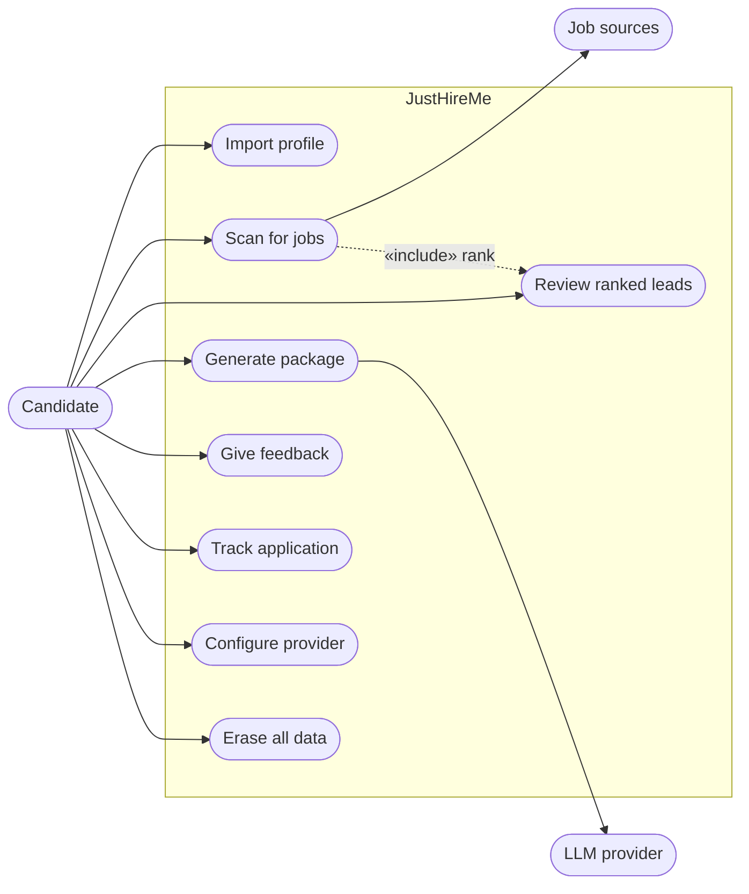
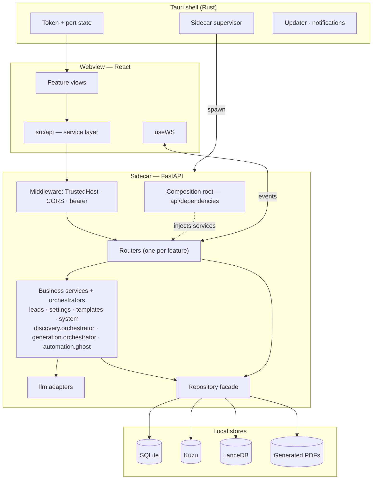
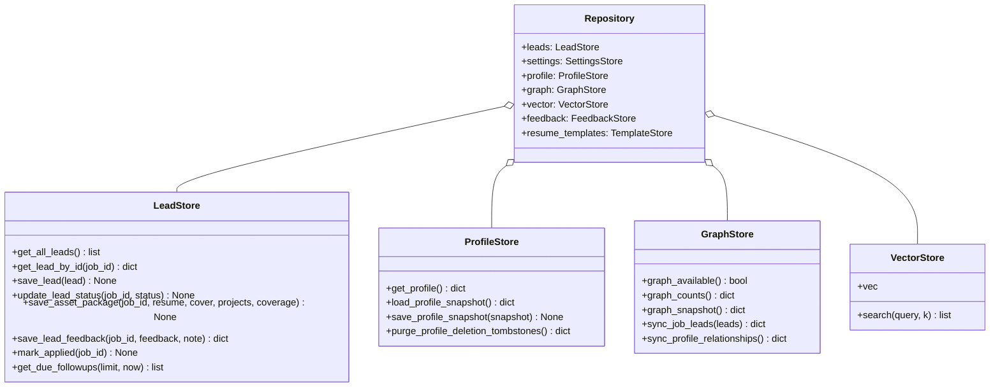
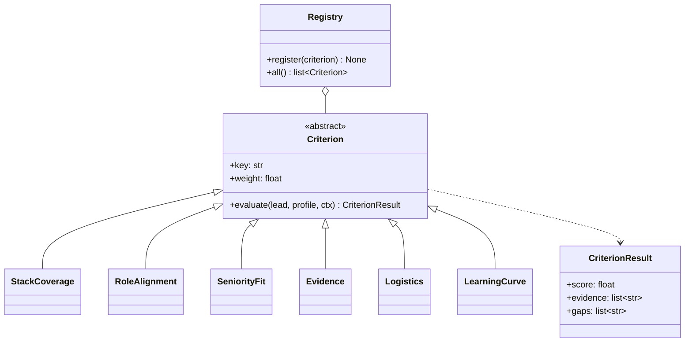
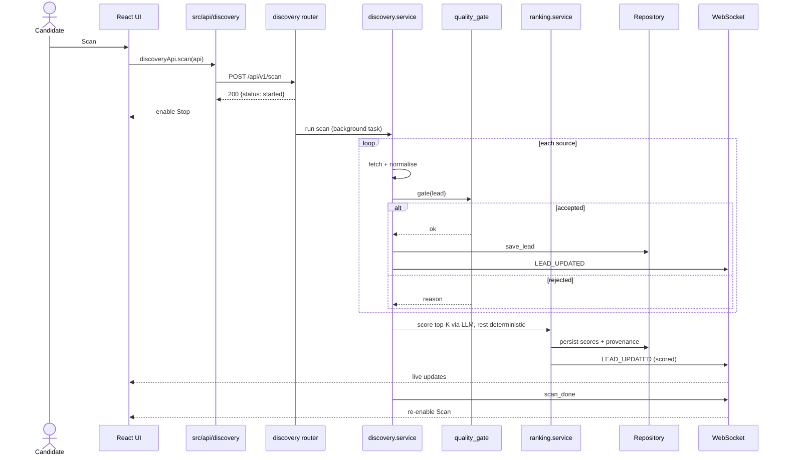
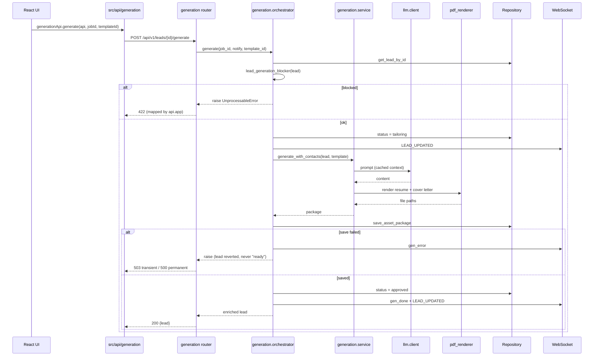
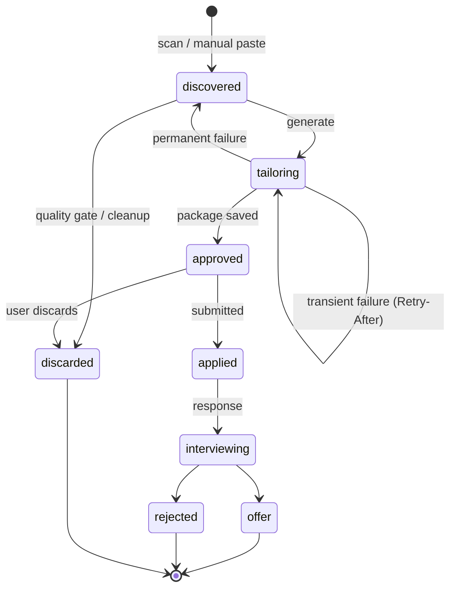
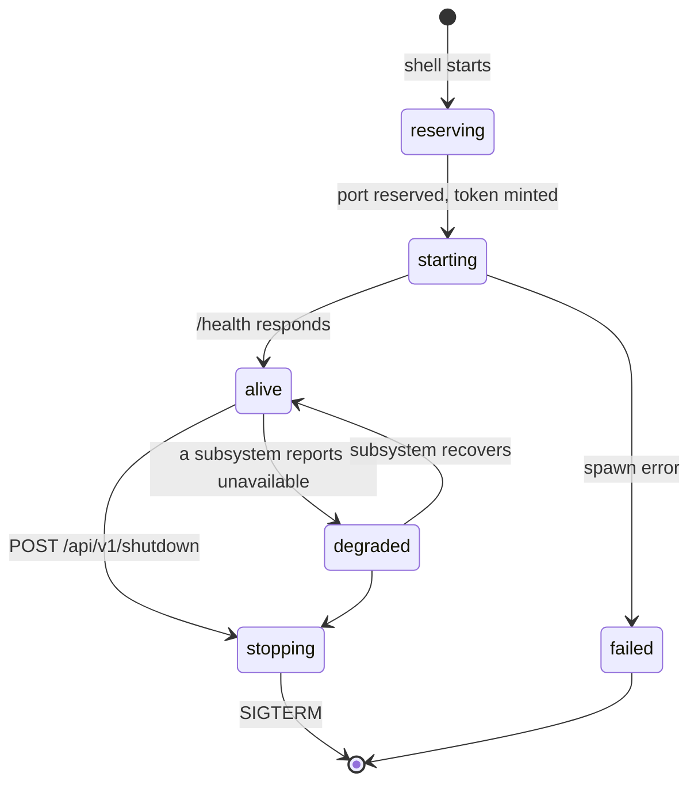
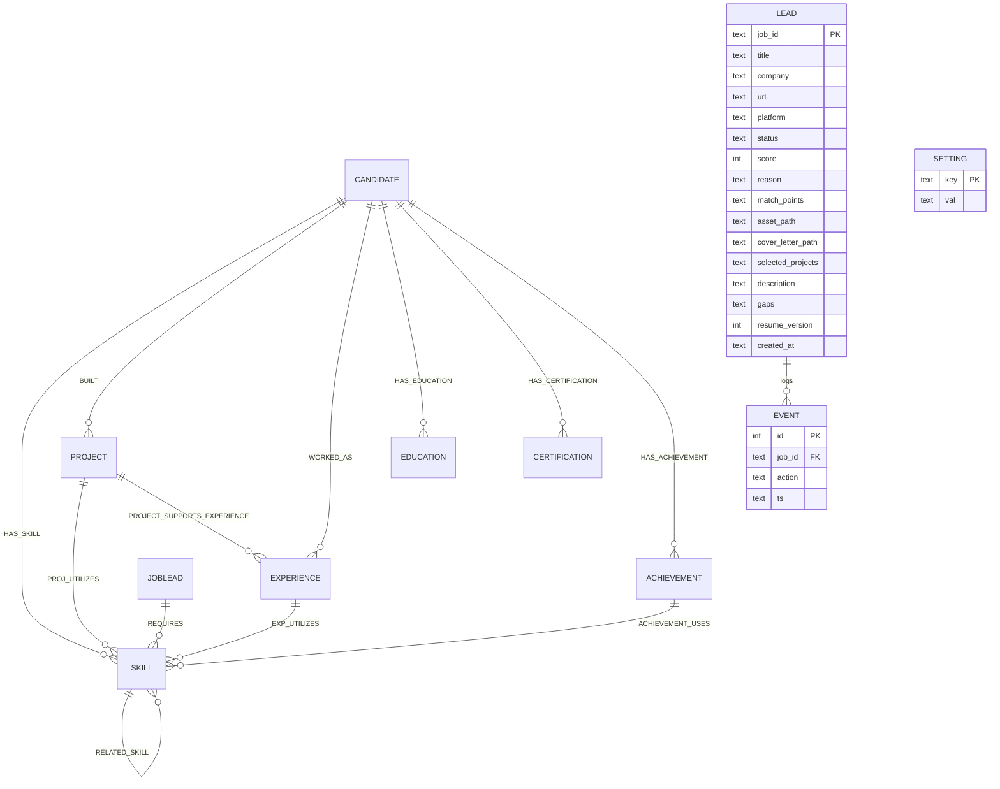
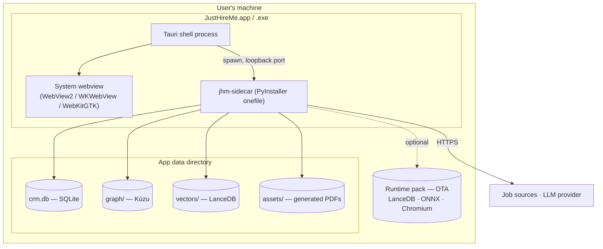

# UML — JustHireMe

Structural and behavioural models. Diagrams are Mermaid, so they render in
GitHub and in the docs site without a separate toolchain.

---

## 1. Use case

---

## 2. Component diagram

---

## 3. Class diagram — data access

## 3.1 Class diagram — ranking criteria

The criteria set is open for extension: a new criterion implements the base and
registers itself, and nothing else changes.

---

## 4. Sequence — scan and rank

## 4.1 Sequence — generate a package

---

## 5. State machine — lead lifecycle

## 5.1 State machine — sidecar lifecycle

---

## 6. Entity relationships

> The graph entities (upper half) live in Kùzu; `LEAD`, `EVENT` and `SETTING`
> live in SQLite. They are deliberately separate stores — see
> [LLD.md §3](LLD.md).

---

## 7. Deployment

The installer stays slim: the heavy optional runtime (vector store, local
embedding model, browser) ships as an over-the-air **runtime pack** installed on
demand, not bundled into the installer.
